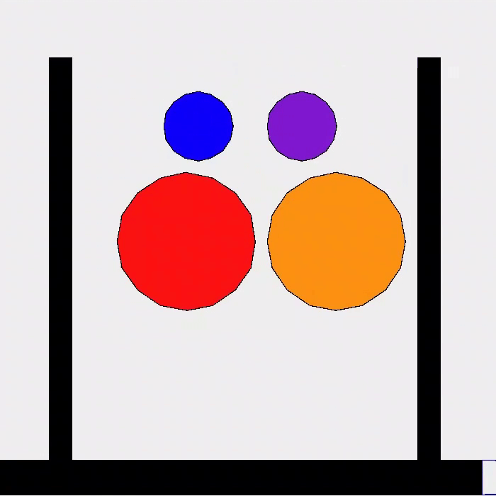
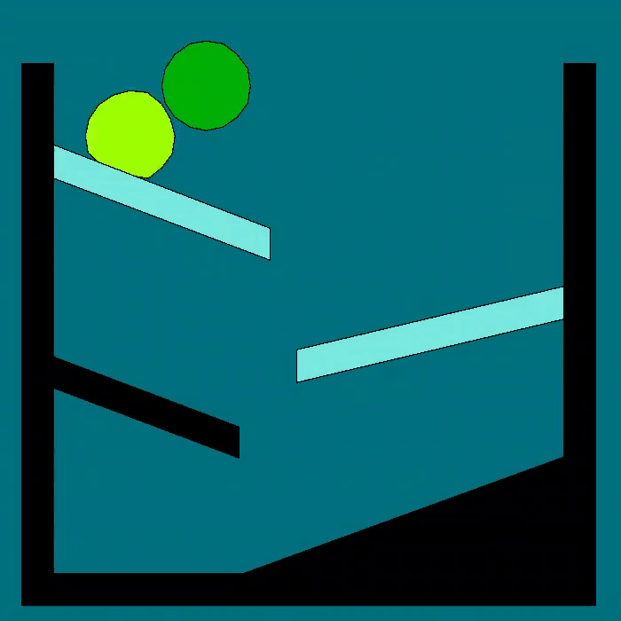

# Soft Body Physics Simulation
This Java project simulates soft-body physics, representing deformable objects 
as mass points connected by springs. The system allows the simulation of various 
forces such as gravity and spring forces, making the bodies respond realistically 
to external influences. This project was inspired by "Advanced Character Physics" by
Thomas Jakobsen

## Features
- __Mass Points__: Each mass point represents a material point with a defined 
mass. These points are connected by springs, forming a soft body.

- __Springs__: The connections between mass points are modeled as springs. 
Users can define the spring's elasticity, damping coefficient, and critical 
values to prevent excessive compression.

- __Collision System__: The simulation includes a collision system with two types
of collision boxes:

  - __Static Triangle__: Represents a static triangle that doesn't move.

  - __Triangle Collision Box__: Connects three mass points, simulating a cohesive 
body. Users can specify exclusion rules, preventing collisions between certain points.

- __Graphics Modes__:

  - __Physics Drawing Mode__: Displays mass points and connections, with spring 
connections changing color based on the forces applied.
  - __Mesh Drawing Mode__: Shows objects of type Mesh formed by connecting 
arbitrary mass points. This is a graphical mode for visual representation.

- __Telemetry__: Real-time telemetry provides information on the time consumed by 
different computations, such as collision calculations. Average, minimum, and maximum 
times are displayed in the console.

- __GUI Separation__: The program utilizes two threads—one for physics calculations 
and the other for rendering. This ensures smooth and responsive visualization.

### Adaptive Time Stepping: 
The simulation adapts the time step based on the time elapsed since the last frame,
preventing a slowdown in simulation time during complex calculations.

## Demo Scenes
The project includes three demo scenes to showcase its capabilities:

### Scene 1, Basic Scene: 
Demonstrates simple scenarios with boxes and a box hanging on a spring.

 

### Scene 2, Complex Shapes: 
Displays more intricate shapes resembling spheres to showcase the system's 
handling of complex bodies.

 

### Scene 3, Fricrion: 
Shows two blobs sliding on different surfaces with varying friction. This demo 
highlights the ability to modify surface friction.

 

## Usage
To run the program, the Java classes to build the simulation and execute the 
MainFrame class. The GUI provides buttons to run different demo scenes.

### Future Improvements
The project could be enhanced by implementing GPU-based computations and leveraging
multi-threading, particularly for collision and particle effects calculations.